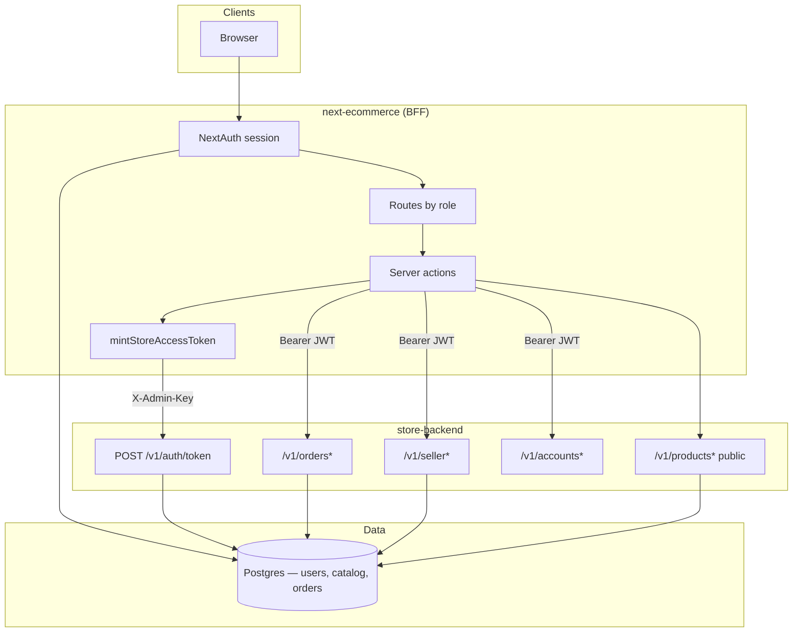
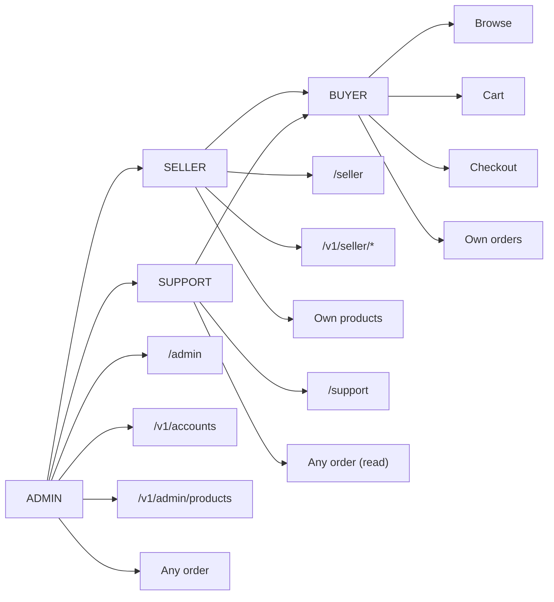
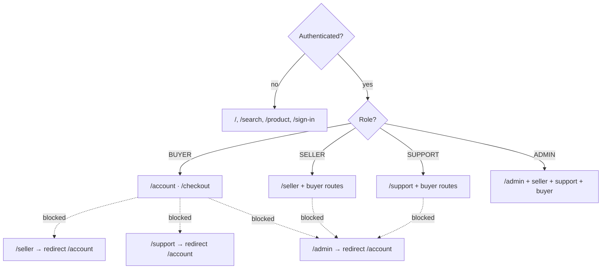
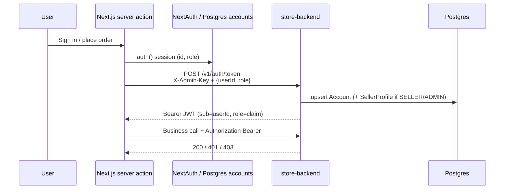
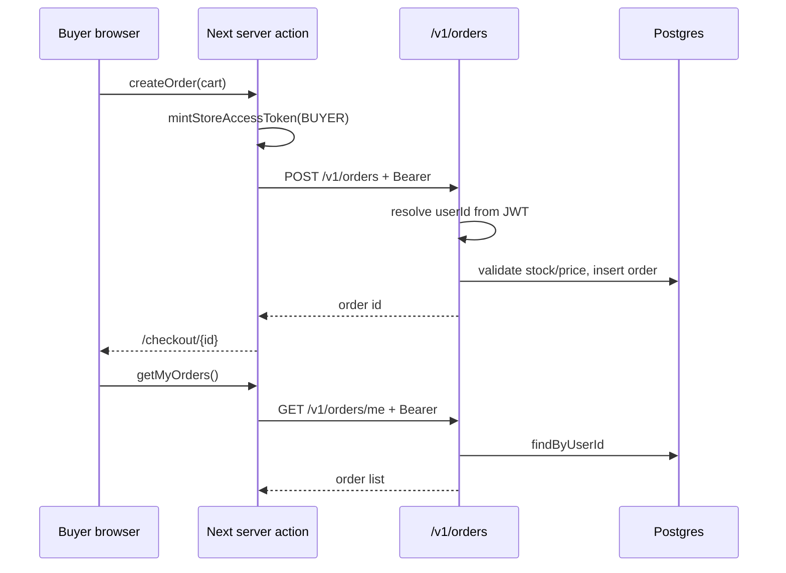
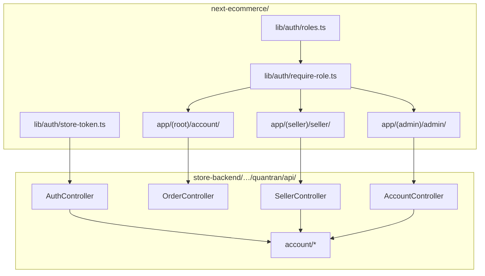

# Role-based marketplace structure

Roles used across **storefront** (`next-ecommerce`) and **store API** (`store-backend`):

| Role | Who | Default home | Capabilities |
|------|-----|--------------|--------------|
| **BUYER** | Shoppers | `/account` | Browse, cart, checkout, own orders |
| **SELLER** | Merchants | `/seller` | Buyer capabilities + seller workspace + seller APIs |
| **SUPPORT** | Customer service | `/support` | Buyer capabilities + view any order (no catalog/user admin) |
| **ADMIN** | Platform ops | `/admin` | All of the above + user/role admin + catalog override |

Legacy strings `User` / `Admin` are normalized to `BUYER` / `ADMIN` on login.

---

## System overview



---

## Role access model





---

## Auth bridge (token mint)



---

## Order flow (buyer)



---

## Data model (roles)

```mermaid
erDiagram
  ACCOUNT ||--o| SELLER_PROFILE : has
  ACCOUNT ||--o{ PRODUCT : owns
  ACCOUNT ||--o{ STORE_ORDER : places

  ACCOUNT {
    string id PK
    string email
    string password_hash
    string role "BUYER|SELLER|ADMIN"
    boolean active
  }

  SELLER_PROFILE {
    string account_id PK_FK
    string shop_name
    boolean verified
  }

  PRODUCT {
    string id PK
    string seller_account_id FK "nullable = platform"
    string slug
    boolean is_published
  }

  STORE_ORDER {
    string id PK
    string user_id FK
    string status
    boolean is_paid
  }
```

---

## Package & route map



---

## Frontend layout

```
next-ecommerce/
  lib/auth/
    roles.ts              # ROLES, normalizeRole, access helpers
    require-role.ts       # requireSession / requireSeller / requireAdmin
    store-token.ts        # BFF JWT mint (server-only)
  lib/db/
    postgres.ts           # shared pg pool (DATABASE_URL)
    users.ts              # accounts CRUD for NextAuth
  app/(root)/account/     # Buyer hub + orders
  app/(seller)/seller/    # Seller overview, products, orders (shell)
  app/(support)/support/  # Support order lookup + recent orders
  app/(admin)/admin/      # Admin overview, users, catalog (shell)
  auth.config.ts          # Route guards for /account /seller /support /admin
```

Signup lets users choose **Buyer** or **Seller**. Admin and support are invite-only / seeded.

Demo seeds (after `npm run seed` with Postgres up):

- `buyer@example.com` / `BuyerPass123!`
- `seller@example.com` / `SellerPass123!`
- `support@example.com` / `SupportPass123!`
- `admin@example.com` / env `ADMIN_PASSWORD`

## Backend layout

```
store-backend/src/main/java/quantran/api/
  account/
    Role.java
    AccountEntity.java
    SellerProfileEntity.java
    AccountRepository.java
    SellerProfileRepository.java
    AccountService.java
  controller/
    AuthController.java      # mints JWT + upserts account (role claim)
    AccountController.java   # /v1/accounts/me, list, PATCH role (admin)
    SellerController.java    # /v1/seller/me|products|orders (GET/POST/PATCH products; PATCH order status)
    OrderController.java     # Bearer + owner checks; GET /me; assist/recent|by-email; POST /{id}/cancel
    ProductAdminController   # platform catalog writes (X-Admin-Key)
  entity/ProductEntity.java  # seller_account_id ownership
```

Flyway: `V4__accounts_roles_seller.sql`, `V5__accounts_auth_credentials.sql`, `V6__persistent_carts.sql`, `V7__order_item_shipped.sql`

### Auth bridge (summary)

1. NextAuth owns login against Postgres `accounts` (`password_hash` + `role`).
2. Server actions mint API JWT via `mintStoreAccessToken` → `POST /v1/auth/token` with `X-Admin-Key` (never from the browser).
3. Order + seller/admin/cart APIs require `Authorization: Bearer …`; order get elevates for SUPPORT/ADMIN; pay stays owner/ADMIN; cancel elevates for SUPPORT/ADMIN (no refund).
4. `GET /v1/orders/me` backs the buyer order list; `GET /v1/orders/assist/recent` and `GET /v1/orders/assist/by-email` for support; `POST /v1/orders/{id}/cancel` restocks.
5. Signed-in carts persist via `GET/PUT/DELETE /v1/cart` (Zustand + localStorage for guests / offline UI).

## Next build steps

- ~~Connect storefront seller UI to `/v1/seller/products` create/update~~ (v1.2.1)
- ~~Seller order fulfillment join (order items × seller products)~~ (v1.2.2)
- ~~Sync NextAuth role changes → store accounts~~ (v1.2.3 — admin UI + mint upsert)
- ~~Seller product edit (price/stock form) beyond publish toggle~~ (v1.2.4)
- ~~Harden admin catalog page against `/v1/admin/products`~~ (v1.2.5)
- ~~Single Postgres DB (drop Mongo users + order fallback)~~ (v1.3.0)
- ~~Cart server revalidation / persistent cart~~ (v1.3.1)
- ~~Debounce cart PUT traffic / revalidate line prices against live catalog on hydrate~~ (v1.3.2)
- ~~Seller order status updates (fulfill / ship) beyond list view~~ (v1.3.3)
- ~~Optional SUPPORT role~~ (v1.3.4)
- ~~Per-seller line fulfillment for multi-seller orders~~ (v1.3.5)
- ~~Buyer order cancel / refund flow~~ (v1.3.6 — cancel + restock; no processor refund)
- ~~Order search by email for support desk~~ (v1.3.7)
