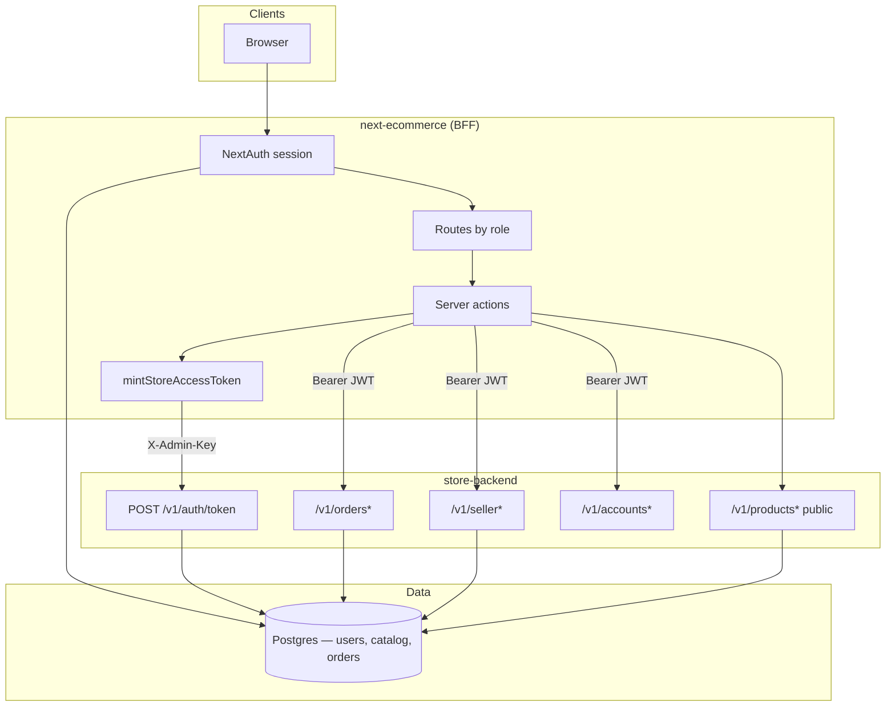
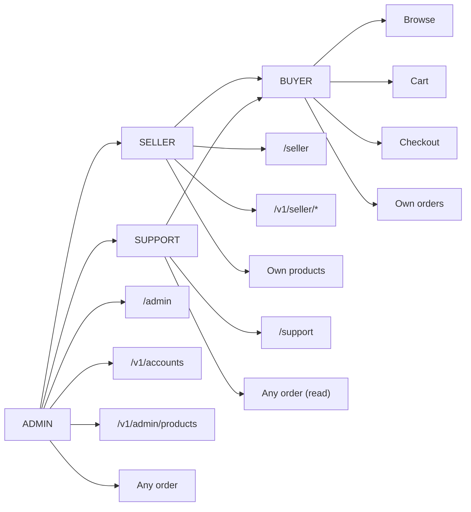
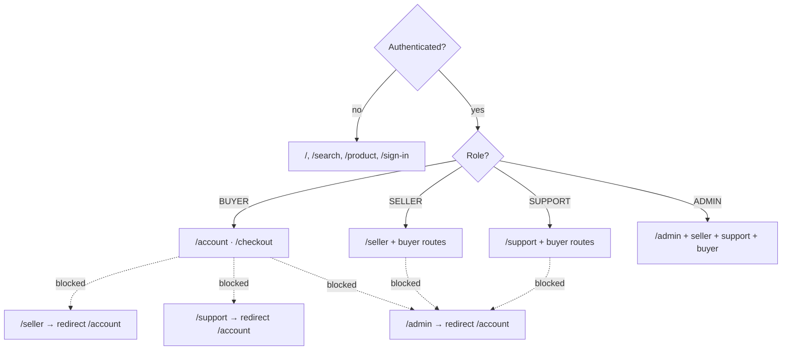
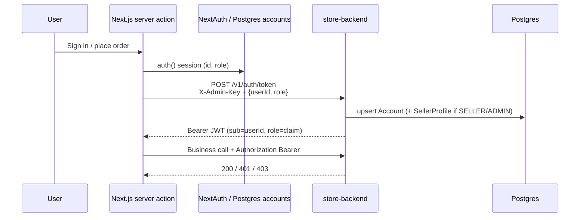
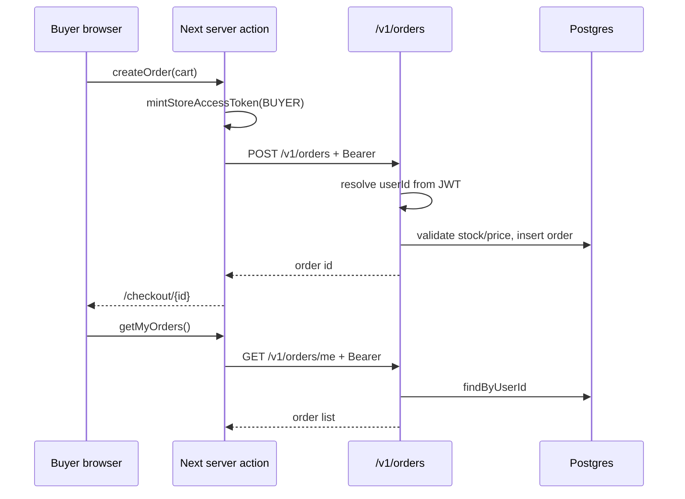
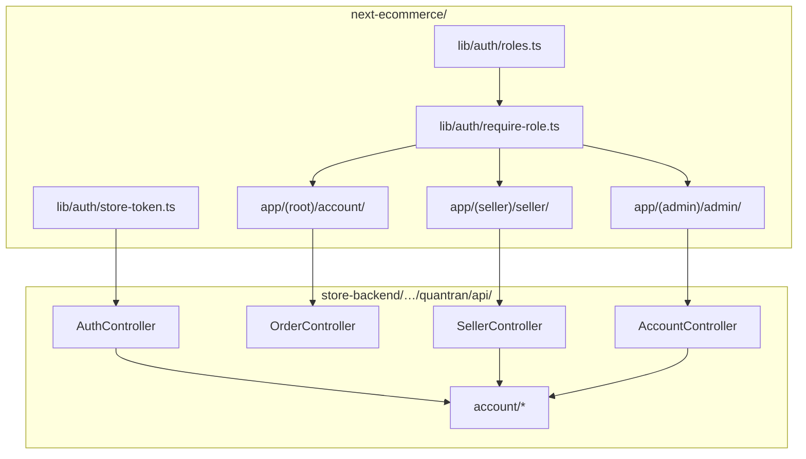

# Role-based marketplace structure

Roles used across **storefront** (`next-ecommerce`) and **store API** (`store-backend`):

| Role | Who | Default home | Capabilities |
|------|-----|--------------|--------------|
| **BUYER** | Shoppers | `/account` | Browse, cart, checkout, own orders |
| **SELLER** | Merchants | `/seller` | Buyer capabilities + seller workspace + seller APIs |
| **SUPPORT** | Customer service | `/support` | Buyer capabilities + view any order (no catalog/user admin) |
| **ADMIN** | Platform ops | `/admin` | All of the above + user/role admin + catalog override |

Legacy strings `User` / `Admin` are normalized to `BUYER` / `ADMIN` on login.

---

## System overview



---

## Role access model





---

## Auth bridge (token mint)



---

## Order flow (buyer)



---

## Data model (roles)

```mermaid
erDiagram
  ACCOUNT ||--o| SELLER_PROFILE : has
  ACCOUNT ||--o{ PRODUCT : owns
  ACCOUNT ||--o{ STORE_ORDER : places

  ACCOUNT {
    string id PK
    string email
    string password_hash
    string role "BUYER|SELLER|ADMIN"
    boolean active
  }

  SELLER_PROFILE {
    string account_id PK_FK
    string shop_name
    boolean verified
  }

  PRODUCT {
    string id PK
    string seller_account_id FK "nullable = platform"
    string slug
    boolean is_published
  }

  STORE_ORDER {
    string id PK
    string user_id FK
    string status
    boolean is_paid
  }
```

---

## Package & route map



---

## Frontend layout

```
next-ecommerce/
  lib/auth/
    roles.ts              # ROLES, normalizeRole, access helpers
    require-role.ts       # requireSession / requireSeller / requireAdmin
    store-token.ts        # BFF JWT mint (server-only)
  lib/db/
    postgres.ts           # shared pg pool (DATABASE_URL)
    users.ts              # accounts CRUD for NextAuth
  app/(root)/account/     # Buyer hub + orders
  app/(seller)/seller/    # Seller overview, products, orders (shell)
  app/(support)/support/  # Support order lookup + recent orders
  app/(admin)/admin/      # Admin overview, orders, users, catalog, audit (shell)
  auth.config.ts          # Route guards for /account /seller /support /admin
```

Signup lets users choose **Buyer** or **Seller**. Admin and support are invite-only / seeded.

Demo seeds (after `npm run seed` with Postgres up):

- `buyer@example.com` / `BuyerPass123!`
- `seller@example.com` / `SellerPass123!`
- `support@example.com` / `SupportPass123!`
- `admin@example.com` / env `ADMIN_PASSWORD`

## Backend layout

```
store-backend/src/main/java/quantran/api/
  account/
    Role.java
    AccountEntity.java
    SellerProfileEntity.java
    AccountRepository.java
    SellerProfileRepository.java
    AccountService.java
  controller/
    AuthController.java      # mints JWT + upserts account (role claim)
    AccountController.java   # /v1/accounts/me, list, PATCH role (admin)
    SellerController.java    # /v1/seller/me|products|orders|analytics; PATCH order status
    OrderController.java     # Bearer + owner checks; GET /me; assist/recent|by-email; POST /{id}/cancel; GET/POST /{id}/notes
    ProductAdminController   # platform catalog writes (X-Admin-Key)
  entity/ProductEntity.java  # seller_account_id ownership
```

Flyway: `V4__accounts_roles_seller.sql`, `V5__accounts_auth_credentials.sql`, `V6__persistent_carts.sql`, `V7__order_item_shipped.sql`, `V8__order_notes.sql`, `V9__order_note_visibility.sql`, `V10__account_notify_order_notes.sql`, `V11__order_note_email_queue.sql`, `V12__account_order_note_email_mode.sql`, `V13__account_quiet_hours.sql`, `V14__urgent_notes_sms_push.sql`, `V15__in_app_notifications.sql`, `V16__in_app_mute_prefs.sql`, `V17__product_reviews.sql`, `V18__coupons.sql`, `V19__seller_payouts.sql`, `V20__low_stock_alerts.sql`, `V21__partial_refunds.sql`, `V22__staff_audit_log.sql`, `V23__support_ticket_assignments.sql`, `V24__wishlist.sql`, `V25__order_returns.sql`, `V26__return_refund_meta.sql`, `V27__gift_cards.sql`, `V28__saved_addresses.sql`, `V29__inventory_reservation_index.sql`, `V30__newsletter_subscribers.sql`, `V31__abandoned_cart_reminders.sql`

### Auth bridge (summary)

1. NextAuth owns login against Postgres `accounts` (`password_hash` + `role`).
2. Server actions mint API JWT via `mintStoreAccessToken` → `POST /v1/auth/token` with `X-Admin-Key` (never from the browser).
3. Order + seller/admin/cart APIs require `Authorization: Bearer …`; order get elevates for SUPPORT/ADMIN **or** product-scoped SELLER; pay stays owner/ADMIN **or** `X-Admin-Key` (webhooks); cancel elevates for SUPPORT/ADMIN (PayPal/Stripe refund from storefront when paid); order notes (`GET/POST /v1/orders/{id}/notes`) elevate for SUPPORT/ADMIN or product-scoped sellers (PUBLIC); `INTERNAL` notes are staff-only.
4. `GET /v1/orders/me` backs the buyer order list (`status` / `from` / `to` filters); `GET /v1/orders/assist/recent` and `GET /v1/orders/assist/by-email` for support; `POST /v1/orders/{id}/cancel` restocks (optional refund metadata).
5. Signed-in carts persist via `GET/PUT/DELETE /v1/cart` (Zustand + localStorage for guests / offline UI).
6. Payment webhooks at `/api/webhooks/stripe` and `/api/webhooks/paypal` mark orders paid when client approve is missed.

## Next build steps

- ~~Connect storefront seller UI to `/v1/seller/products` create/update~~ (v1.2.1)
- ~~Seller order fulfillment join (order items × seller products)~~ (v1.2.2)
- ~~Sync NextAuth role changes → store accounts~~ (v1.2.3 — admin UI + mint upsert)
- ~~Seller product edit (price/stock form) beyond publish toggle~~ (v1.2.4)
- ~~Harden admin catalog page against `/v1/admin/products`~~ (v1.2.5)
- ~~Single Postgres DB (drop Mongo users + order fallback)~~ (v1.3.0)
- ~~Cart server revalidation / persistent cart~~ (v1.3.1)
- ~~Debounce cart PUT traffic / revalidate line prices against live catalog on hydrate~~ (v1.3.2)
- ~~Seller order status updates (fulfill / ship) beyond list view~~ (v1.3.3)
- ~~Optional SUPPORT role~~ (v1.3.4)
- ~~Per-seller line fulfillment for multi-seller orders~~ (v1.3.5)
- ~~Buyer order cancel / refund flow~~ (v1.3.6 — cancel + restock; no processor refund)
- ~~Order search by email for support desk~~ (v1.3.7)
- ~~PayPal / Stripe refund after paid cancel~~ (v1.3.8 — PayPal live; Stripe skipped until checkout enabled)
- ~~Admin order overview (platform-wide list beyond support assist)~~ (v1.3.9)
- ~~Buyer order list filters (status / date)~~ (v1.3.10)
- ~~Enable Stripe checkout + PaymentIntent refunds~~ (v1.3.11)
- ~~Seller analytics (sales / unshipped counts)~~ (v1.3.12)
- ~~Webhook-driven payment confirmation (PayPal / Stripe) as backup to client approve~~ (v1.3.13)
- ~~Email receipts on paid / shipped~~ (v1.3.14)
- ~~Rate-limit public catalog search abuse hardening~~ (v1.3.15)
- ~~Product image upload for seller listings~~ (v1.3.16)
- ~~Order notes / support ticket thread~~ (v1.3.17)
- ~~Cloud object storage for product images (S3-compatible) beyond local uploads~~ (v1.3.18)
- ~~Private staff-only order notes (internal visibility)~~ (v1.3.19)
- ~~Seller participation in order notes (product-scoped)~~ (v1.3.20)
- ~~Product image delete / replace cleanup in object storage~~ (v1.3.21)
- ~~Notify parties by email when a public order note is posted~~ (v1.3.22)
- ~~Buyer/seller email preferences for order-note notifications~~ (v1.3.23)
- ~~Digest / batch order-note emails instead of per-message~~ (v1.3.24)
- ~~Per-user immediate vs digest preference for order-note emails~~ (v1.3.25)
- ~~Quiet hours for order-note emails~~ (v1.3.26)
- ~~SMS / push channel for urgent order notes~~ (v1.3.27)
- ~~In-app notification center for order notes~~ (v1.3.28)
- ~~Real-time notification refresh (SSE / websocket)~~ (v1.3.29)
- ~~Desktop notifications when the storefront tab is backgrounded~~ (v1.3.30)
- ~~In-app mute preferences (global inbox + per-order + live toasts)~~ (v1.3.31)
- ~~In-app notifications for paid / shipped / cancelled orders~~ (v1.3.32)
- ~~Redis pub/sub fanout for live notification SSE~~ (v1.3.33)
- ~~Product reviews & ratings (verified buyers)~~ (v1.3.34)
- ~~Checkout promo codes / coupons~~ (v1.3.35)
- ~~Seller payouts / earnings history~~ (v1.3.36)
- ~~Low-stock alerts for sellers~~ (v1.3.37)
- ~~Partial line-item refunds (support/admin)~~ (v1.3.38)
- ~~Support ticket queue UI (order-note threads)~~ (v1.3.39)
- ~~Staff audit log for support/admin actions~~ (v1.3.40)
- ~~Support ticket assignment (claim / reassign)~~ (v1.3.41)
- ~~Admin KPI dashboard~~ (v1.3.42)
- ~~Playwright E2E smoke tests~~ (v1.3.43)
- ~~Buyer wishlist / save for later~~ (v1.3.44)
- ~~Buyer return / RMA requests~~ (v1.3.45)
- ~~Auto-refund on approved returns~~ (v1.3.46)
- ~~Wishlist hearts on product cards~~ (v1.3.47)
- ~~Return request email / in-app notify~~ (v1.3.48)
- ~~Checkout gift cards / store credit~~ (v1.3.49)
- ~~Saved shipping addresses~~ (v1.3.50)
- ~~Inventory reservations at checkout (atomic + unpaid TTL)~~ (v1.3.51)
- ~~Buyer product compare~~ (v1.3.52)
- ~~Seller product CSV import~~ (v1.3.53)
- ~~Order invoice PDF download~~ (v1.3.54)
- ~~Recently viewed products carousel~~ (v1.3.55)
- ~~Seller payout CSV export~~ (v1.3.56)
- ~~Newsletter / marketing email signup~~ (v1.3.57)
