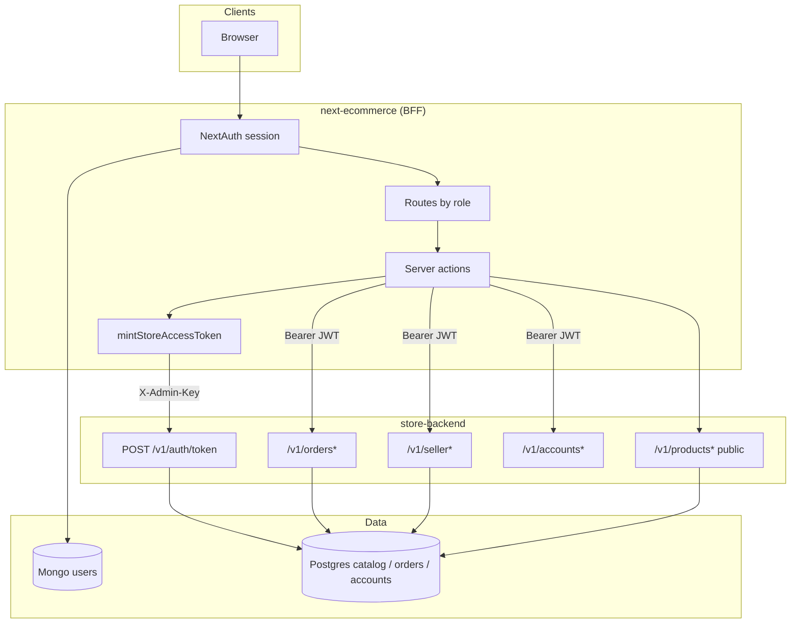
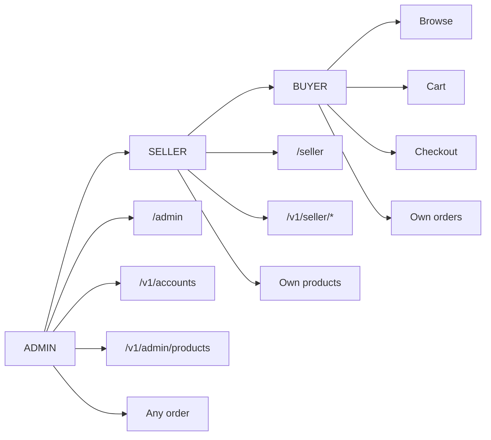
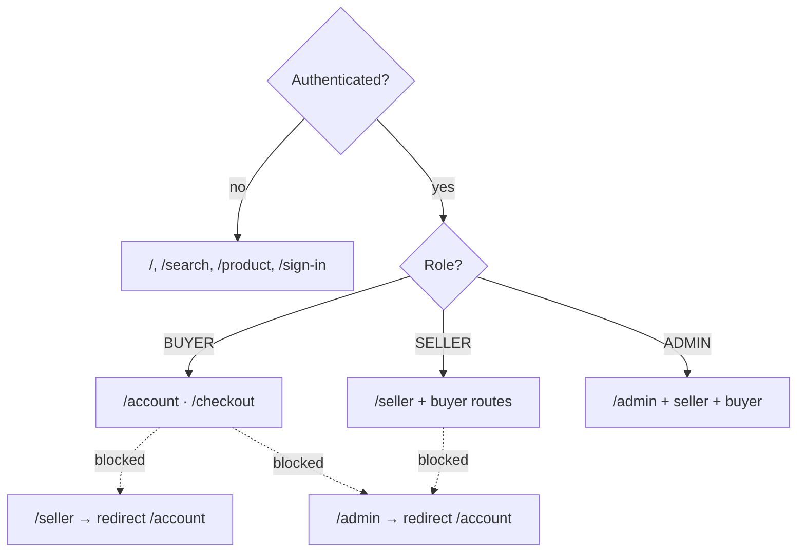
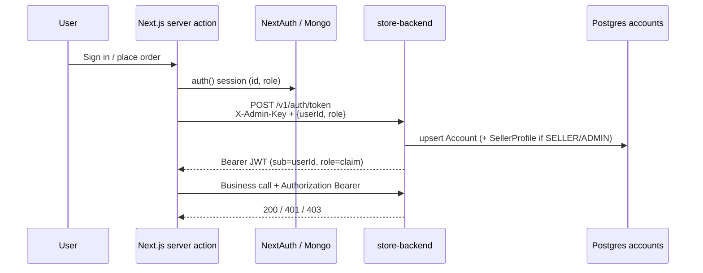
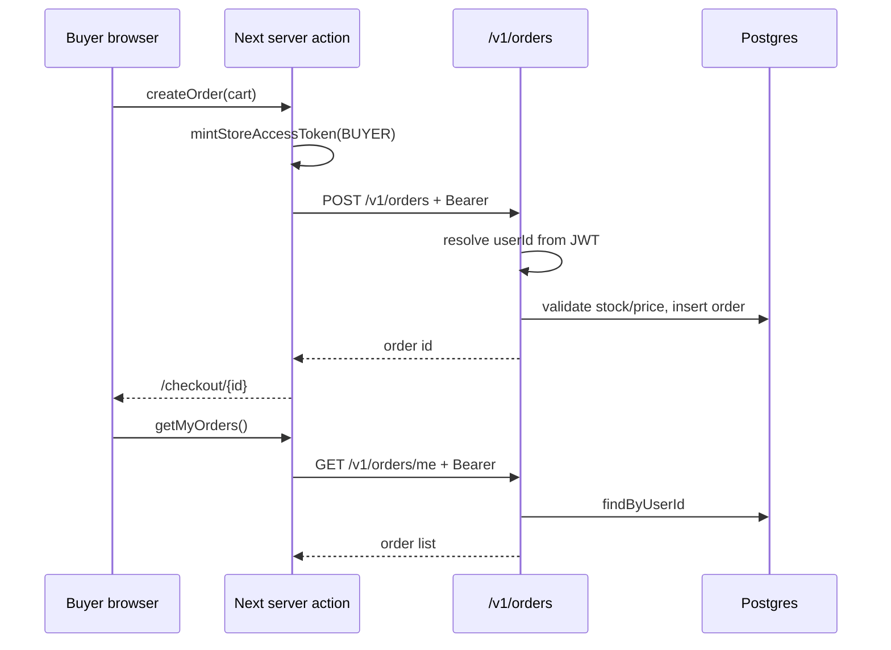
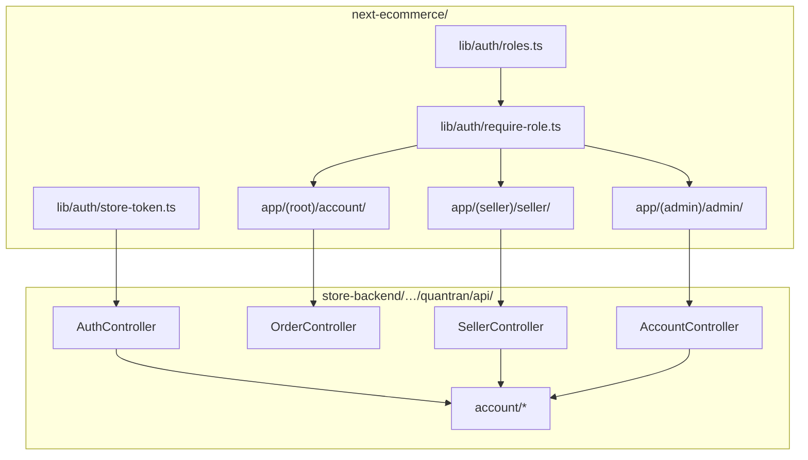

# Role-based marketplace structure

Roles used across **storefront** (`next-ecommerce`) and **store API** (`store-backend`):

| Role | Who | Default home | Capabilities |
|------|-----|--------------|--------------|
| **BUYER** | Shoppers | `/account` | Browse, cart, checkout, own orders |
| **SELLER** | Merchants | `/seller` | Buyer capabilities + seller workspace + seller APIs |
| **ADMIN** | Platform ops | `/admin` | All of the above + user/role admin + catalog override |

Legacy strings `User` / `Admin` are normalized to `BUYER` / `ADMIN` on login.

---

## System overview



---

## Role access model





---

## Auth bridge (token mint)



---

## Order flow (buyer)



---

## Data model (roles)

```mermaid
erDiagram
  ACCOUNT ||--o| SELLER_PROFILE : has
  ACCOUNT ||--o{ PRODUCT : owns
  ACCOUNT ||--o{ STORE_ORDER : places

  ACCOUNT {
    string id PK
    string email
    string role "BUYER|SELLER|ADMIN"
    boolean active
  }

  SELLER_PROFILE {
    string account_id PK_FK
    string shop_name
    boolean verified
  }

  PRODUCT {
    string id PK
    string seller_account_id FK "nullable = platform"
    string slug
    boolean is_published
  }

  STORE_ORDER {
    string id PK
    string user_id FK
    string status
    boolean is_paid
  }
```

---

## Package & route map



---

## Frontend layout

```
next-ecommerce/
  lib/auth/
    roles.ts              # ROLES, normalizeRole, access helpers
    require-role.ts       # requireSession / requireSeller / requireAdmin
    store-token.ts        # BFF JWT mint (server-only)
  app/(root)/account/     # Buyer hub + orders
  app/(seller)/seller/    # Seller overview, products, orders (shell)
  app/(admin)/admin/      # Admin overview, users, catalog (shell)
  auth.config.ts          # Route guards for /account /seller /admin
```

Signup lets users choose **Buyer** or **Seller**. Admin is seeded only (`admin@example.com`).

Demo seeds (after `npm run seed`):

- `buyer@example.com` / `BuyerPass123!`
- `seller@example.com` / `SellerPass123!`
- `admin@example.com` / env `ADMIN_PASSWORD`

## Backend layout

```
store-backend/src/main/java/quantran/api/
  account/
    Role.java
    AccountEntity.java
    SellerProfileEntity.java
    AccountRepository.java
    SellerProfileRepository.java
    AccountService.java
  controller/
    AuthController.java      # mints JWT + upserts account (role claim)
    AccountController.java   # /v1/accounts/me, list, PATCH role (admin)
    SellerController.java    # /v1/seller/me|products|orders (GET/POST/PATCH products)
    OrderController.java     # Bearer + owner checks; GET /me
    ProductAdminController   # platform catalog writes (X-Admin-Key)
  entity/ProductEntity.java  # seller_account_id ownership
```

Flyway: `V4__accounts_roles_seller.sql`

### Auth bridge (summary)

1. NextAuth owns login (Mongo users + `role`).
2. Server actions mint API JWT via `mintStoreAccessToken` → `POST /v1/auth/token` with `X-Admin-Key` (never from the browser).
3. Order + seller/admin APIs require `Authorization: Bearer …`; order get/pay also enforce owner (or ADMIN).
4. `GET /v1/orders/me` backs the buyer order list when the store API is up.

## Next build steps

- ~~Connect storefront seller UI to `/v1/seller/products` create/update~~ (v1.2.1)
- ~~Seller order fulfillment join (order items × seller products)~~ (v1.2.2)
- Sync NextAuth role changes → `PATCH /v1/accounts/{id}/role`
- Optional SUPPORT role if you need customer-service without full admin
