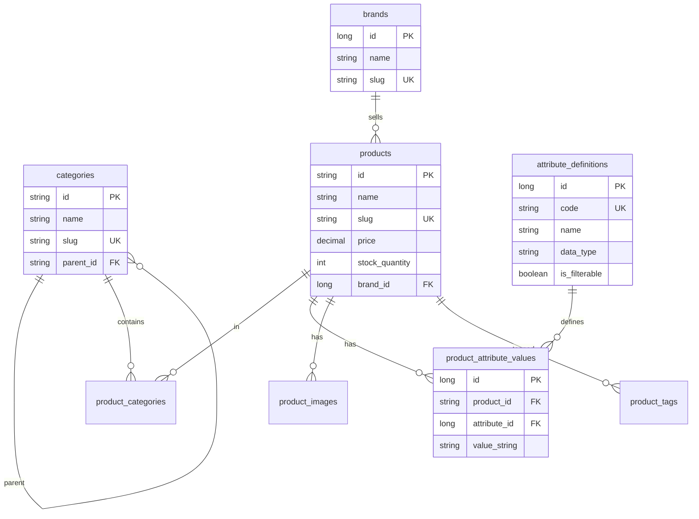

# Commercial Catalog Schema

Amazon-style browse + filter model used by the store API.

## Faceted search flow

1. Client sends filters: `q`, `category`, `brand`, `price`, plus dynamic attrs (`color`, `size`, …)
2. API filters the published catalog
3. API returns matching products **and** facet buckets with counts
4. UI renders filters dynamically from the response (not hardcoded per niche)
